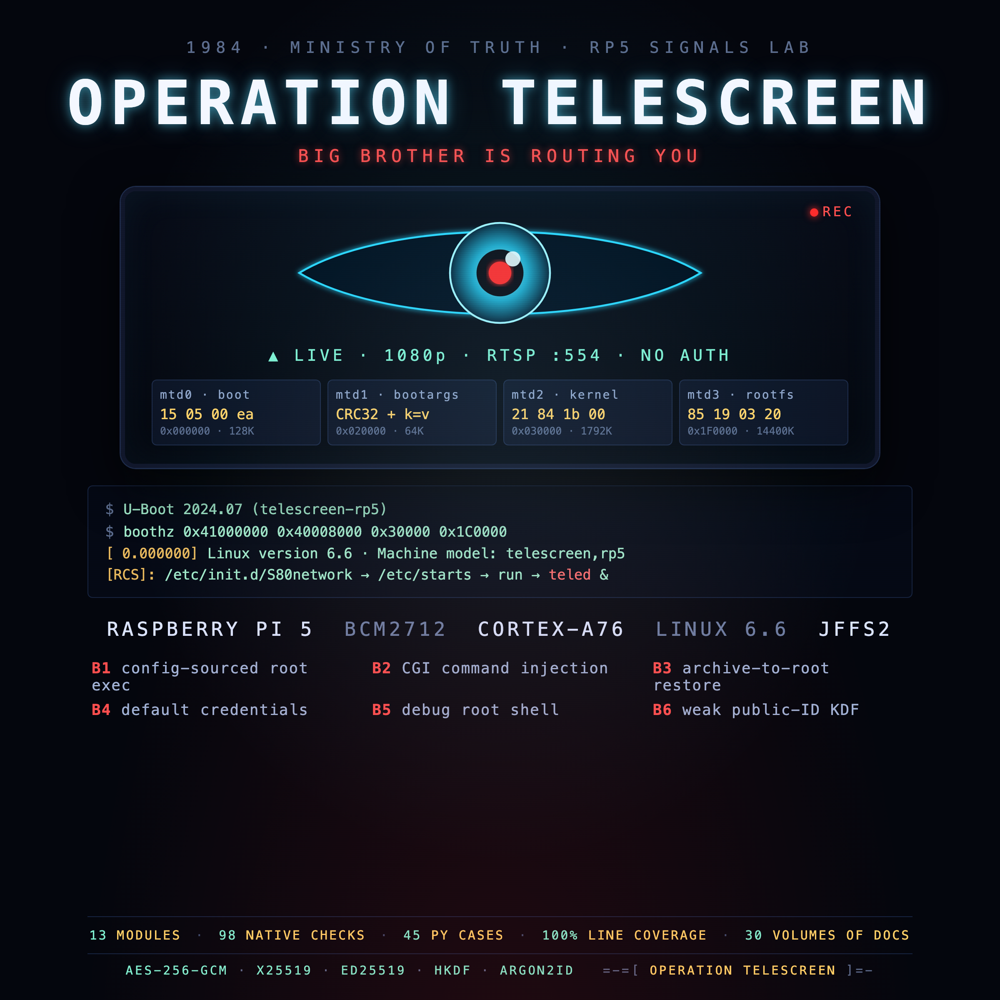

<br>

## FREE Reverse Engineering Self-Study Course [HERE](https://github.com/mytechnotalent/reverse-engineering)
## FREE Embedded Hacking Course [HERE](https://github.com/mytechnotalent/Embedded-Hacking)

<br>

# OPERATION TELESCREEN

### The Ministry's Surveillance Backbone
#### The finale after OPERATION COLD IRON

**A Raspberry Pi 5 teaching lab that rebuilds a captured nation-state camera/router - real Linux, the same four partitions as the real device, and a hardened AEAD channel - written in the house C style.**

<br>

***
**LEGAL DISCLAIMER:**
The information, tools, and code provided in this repository and course are strictly for educational, research, and defensive purposes only. 

You are explicitly prohibited from using any materials contained herein to access, test, modify, or exploit any device, network, or system that you do not own 100% or for which you do not have explicit, documented, and legally binding authorization to interact with.

By using this repository and course, you acknowledge and agree that:

1. Any illegal, unauthorized, or malicious use of this information is solely your responsibility.
2. The author(s) and contributor(s) of this repository and course shall not be held liable for any damages, legal repercussions, criminal charges, or unauthorized actions resulting from the use, misuse, or abuse of the contents herein.
3. You will comply with all applicable local, state, national, and international laws regarding cybersecurity and computer fraud.

**IF YOU DO NOT AGREE WITH THESE TERMS, DO NOT USE THIS REPOSITORY AND COURSE.**

***

<br>

## WHERE THIS FITS

TELESCREEN is the **surveillance backbone of the Ministry** - the Linux/RP5
appliance that watches the industrial edge built in OPERATION COLD IRON. It is
the **finale after OPERATION COLD IRON**: that saga teaches the bare-metal **ARM**
device (the Cortex-M33 cold-chain monitor); TELESCREEN builds the
application-class **ARM** system (Cortex-A76, RP5/Linux) that watches over it.
OPERATION COLD IRON is a planned **ten-act saga** (still in development);
**TELESCREEN is what comes after all ten**, and teaches the same defect classes
one level deeper. The whole saga is **ARM** - the same architecture, one level up.

| work | platform | role in the story |
| ---- | -------- | ----------------- |
| [OPERATION COLD IRON](https://github.com/mytechnotalent/cold-chain-monitor) | ARM Cortex-M33 (RP2350) | the Ministry's cold-chain edge - Act I (saga in development) |
| **TELESCREEN (this repo)** | **ARM Cortex-A76 (Raspberry Pi 5)** | **the surveillance backbone that watches it** |
| [CTF_telescreen](https://github.com/mytechnotalent/CTF_telescreen) | ARM Cortex-A76 (Raspberry Pi 5) | the same device, compromised |

<br>

## THE MINISTRY

The Ministry runs the state: the surveillance, the cold chain, the gates, the
pipelines. NorthPharma is one of its deniable industrial fronts; FROSTLINE does
the work no letterhead will admit to. Against them stands WHITEOUT. OPERATION
COLD IRON is the Ministry's industrial edge; **TELESCREEN is the wall unit that
watches it** - the surveillance backbone that comes after the ten acts.

<br>

## THE COMPANION CTF

This repository is the **defended** device. The **compromised** one - the same
node with the defects left in - lives in the companion repository:

- [OPERATION TELESCREEN CTF](https://github.com/mytechnotalent/CTF_telescreen)

Learn the defect here, then go break it there.

<br>

## What This Is

TELESCREEN is a full embedded-security curriculum built around one artifact: a
captured surveillance camera/router whose firmware is laid out in **four flash
partitions** (`boot`, `bootargs`, `kernel`, `rootfs`). Students carve the image,
reverse the boot chain, open the rootfs, find the backdoors, break the exfiltration
crypto, and then **build an RP5 replica** that boots the *same four-partition layout*
with a hardened **AES-256-GCM** channel.

This project is **format-identical to the real camera**: same `mtdparts`, same
CRC-protected U-Boot environment, same vendor kernel container, same JFFS2 filesystem,
same offsets and sizes. The only differences are the two closed first-stage ROMs
(camera BootROM vs RP5 VideoCore) and the SoC behind the kernel.

<br>

## Hardware

See **[PARTS.md](PARTS.md)** for the full bill of materials: a stock RP5 runs the router,
backdoor, and crypto labs; a camera module is optional for the video lab.

<br>

## How to Use This Repository

1. **Absolute beginner?** Start at [Volume 31](docs/31-prerequisites-and-install.md)
   to install Docker, the JDK, and Ghidra on Windows, Linux, or macOS.
2. **Want the hands-on RE?** Build the target and start reversing:
   the [firmware README](firmware/README.md) and [ghidra README](ghidra/README.md),
   then [Volume 33](docs/33-ghidra-nation-state-re.md).
3. **Want the theory?** Read the core volumes 01-30 in order.
4. **Want the answers?** [ghidra/RESOLUTION_MAP.md](ghidra/RESOLUTION_MAP.md) and
   [Appendix J](docs/appendix/J-ghidra-function-resolution.md) - but reverse each
   function yourself first.

Every document is linked below.

<br>

## The Curriculum - every document in this repository

Read in order. Every title below is a link to the file.

### Start here - prerequisites and the RE workflow

| # | document | teaches |
| - | -------- | ------- |
| 31 | [31-prerequisites-and-install.md](docs/31-prerequisites-and-install.md) | Volume 31 - Prerequisites and Installation (Windows, Linux, macOS) |
| 32 | [32-bench-firmware-and-extraction.md](docs/32-bench-firmware-and-extraction.md) | Volume 32 - The Bench, the Four Images, and Extraction |
| 33 | [33-ghidra-nation-state-re.md](docs/33-ghidra-nation-state-re.md) | Volume 33 - Ghidra and the Nation-State RE Workflow |

### Core volumes 01-30

| # | volume | teaches |
| - | ------ | ------- |
| 01 | [01-world-and-threat.md](docs/01-world-and-threat.md) | Volume 01: World and Threat |
| 02 | [02-the-four-partitions.md](docs/02-the-four-partitions.md) | Volume 02: The Four Partitions |
| 03 | [03-flash-silicon.md](docs/03-flash-silicon.md) | Volume 03: The Image Store |
| 04 | [04-carve-and-verify.md](docs/04-carve-and-verify.md) | Volume 04: Carve and Verify |
| 05 | [05-first-stage-boot.md](docs/05-first-stage-boot.md) | Volume 05: First-Stage Boot |
| 06 | [06-u-boot.md](docs/06-u-boot.md) | Volume 06: U-Boot |
| 07 | [07-environment-crc.md](docs/07-environment-crc.md) | Volume 07: Environment CRC |
| 08 | [08-kernel-container.md](docs/08-kernel-container.md) | Volume 08: Kernel Container |
| 09 | [09-device-tree.md](docs/09-device-tree.md) | Volume 09: Device Tree |
| 10 | [10-command-line-and-mount.md](docs/10-command-line-and-mount.md) | Volume 10: Command Line and Mount |
| 11 | [11-jffs2-nodes.md](docs/11-jffs2-nodes.md) | Volume 11: JFFS2 Nodes |
| 12 | [12-jffs2-in-place-patch.md](docs/12-jffs2-in-place-patch.md) | Volume 12: JFFS2 In-Place Patch |
| 13 | [13-userland-boot.md](docs/13-userland-boot.md) | Volume 13: Userland Boot |
| 14 | [14-http-dispatcher.md](docs/14-http-dispatcher.md) | Volume 14: HTTP Dispatcher |
| 15 | [15-system-sites.md](docs/15-system-sites.md) | Volume 15: `system()` Sites |
| 16 | [16-backdoor-catalogue.md](docs/16-backdoor-catalogue.md) | Volume 16: Backdoor Catalogue |
| 17 | [17-weak-kdf.md](docs/17-weak-kdf.md) | Volume 17: Weak KDF |
| 18 | [18-aead-fundamentals.md](docs/18-aead-fundamentals.md) | Volume 18: AEAD Fundamentals |
| 19 | [19-aes-256-gcm-on-rp5.md](docs/19-aes-256-gcm-on-rp5.md) | Volume 19: AES-256-GCM on RP5 |
| 20 | [20-xchacha20-poly1305.md](docs/20-xchacha20-poly1305.md) | Volume 20: XChaCha20-Poly1305 |
| 21 | [21-x25519-and-hkdf.md](docs/21-x25519-and-hkdf.md) | Volume 21: X25519 and HKDF |
| 22 | [22-ed25519-identity.md](docs/22-ed25519-identity.md) | Volume 22: Ed25519 Identity |
| 23 | [23-argon2id.md](docs/23-argon2id.md) | Volume 23: Argon2id |
| 24 | [24-rp5-as-a-router.md](docs/24-rp5-as-a-router.md) | Volume 24: RP5 as a Router |
| 25 | [25-rp5-as-a-camera.md](docs/25-rp5-as-a-camera.md) | Volume 25: RP5 as a Camera |
| 26 | [26-building-the-images.md](docs/26-building-the-images.md) | Volume 26: Building the Images |
| 27 | [27-flash-and-verify.md](docs/27-flash-and-verify.md) | Volume 27: Flash and Verify |
| 28 | [28-blue-team-detection.md](docs/28-blue-team-detection.md) | Volume 28: Blue-Team Detection |
| 29 | [29-ethics-and-law.md](docs/29-ethics-and-law.md) | Volume 29: Ethics and Law |
| 30 | [30-appendix.md](docs/30-appendix.md) | Volume 30: Appendix |

- [WEEK12_CORTEX_A_RE.md](docs/WEEK12_CORTEX_A_RE.md) - Week 12: Cortex-A Reverse Engineering - Finding the Reset Handler and `main()` in a Stripped Binary

### Appendices A-J

| letter | appendix | role |
| ------ | -------- | ---- |
| A | [A-functions.md](docs/appendix/A-functions.md) | Appendix A: Function Catalogue |
| B | [B-aarch64-disasm.md](docs/appendix/B-aarch64-disasm.md) | Appendix B: Full AArch64 Disassembly |
| C | [C-source-listing.md](docs/appendix/C-source-listing.md) | Appendix C: Full Source Listing |
| D | [D-scripts-listing.md](docs/appendix/D-scripts-listing.md) | Appendix D: Tooling Source Listing |
| E | [E-test-listing.md](docs/appendix/E-test-listing.md) | Appendix E: Test Suite Listing |
| F | [F-constants.md](docs/appendix/F-constants.md) | Appendix F: Constants, Configs, and Check Values |
| G | [G-api-reference.md](docs/appendix/G-api-reference.md) | Appendix G: Per-Function API Reference |
| H | [H-annotated-disasm.md](docs/appendix/H-annotated-disasm.md) | Appendix H: Annotated AArch64 Disassembly |
| I | [I-test-catalogue.md](docs/appendix/I-test-catalogue.md) | Appendix I: Test Catalogue |
| J | [J-ghidra-function-resolution.md](docs/appendix/J-ghidra-function-resolution.md) | Appendix J - Function-by-Function Reverse Engineering |

### Module-by-module reference (`docs/modules/`)

- [01-crc.md](docs/modules/01-crc.md) - Module 01: crc
- [02-partition.md](docs/modules/02-partition.md) - Module 02: partition
- [03-env.md](docs/modules/03-env.md) - Module 03: env
- [04-container.md](docs/modules/04-container.md) - Module 04: container
- [05-jffs2.md](docs/modules/05-jffs2.md) - Module 05: jffs2
- [06-aead.md](docs/modules/06-aead.md) - Module 06: aead
- [07-beacon.md](docs/modules/07-beacon.md) - Module 07: beacon
- [08-kex.md](docs/modules/08-kex.md) - Module 08: kex
- [09-identity.md](docs/modules/09-identity.md) - Module 09: identity
- [10-collector.md](docs/modules/10-collector.md) - Module 10: collector
- [11-camera.md](docs/modules/11-camera.md) - Module 11: camera
- [12-teled.md](docs/modules/12-teled.md) - Module 12: teled
- [13-main.md](docs/modules/13-main.md) - Module 13: main

### Guided walkthroughs (`docs/walkthrough/`)

- [01-crc.md](docs/walkthrough/01-crc.md) - Walkthrough 01: `crc`
- [02-partition.md](docs/walkthrough/02-partition.md) - Walkthrough 02: `partition`
- [03-env.md](docs/walkthrough/03-env.md) - Walkthrough 03: `env`
- [04-container.md](docs/walkthrough/04-container.md) - Walkthrough 04: `container`
- [05-jffs2.md](docs/walkthrough/05-jffs2.md) - Walkthrough 05: `jffs2`
- [06-beacon.md](docs/walkthrough/06-beacon.md) - Walkthrough 06: `beacon`
- [07-collector.md](docs/walkthrough/07-collector.md) - Walkthrough 07: `collector`
- [08-camera.md](docs/walkthrough/08-camera.md) - Walkthrough 08: `camera`
- [09-teled.md](docs/walkthrough/09-teled.md) - Walkthrough 09: `teled`
- [10-main.md](docs/walkthrough/10-main.md) - Walkthrough 10: `main`
- [11-aead.md](docs/walkthrough/11-aead.md) - Walkthrough 11: `aead`
- [12-kex.md](docs/walkthrough/12-kex.md) - Walkthrough 12: `kex`
- [13-identity.md](docs/walkthrough/13-identity.md) - Walkthrough 13: `identity`
- [14-tooling.md](docs/walkthrough/14-tooling.md) - Walkthrough 14: The Tooling
- [15-tests.md](docs/walkthrough/15-tests.md) - Walkthrough 15: The Test Suite
- [16-ctf-solve.md](docs/walkthrough/16-ctf-solve.md) - Walkthrough 16: Solving the CTF (Offensive Path)
- [17-bytes.md](docs/walkthrough/17-bytes.md) - Walkthrough 17: Byte-Level Artifact Walkthrough
- [18-crypto-internals.md](docs/walkthrough/18-crypto-internals.md) - Walkthrough 18: Cryptography Internals
- [19-re-labs.md](docs/walkthrough/19-re-labs.md) - Walkthrough 19: Reverse-Engineering Labs
- [20-network.md](docs/walkthrough/20-network.md) - Walkthrough 20: Network Protocols
- [21-hardware.md](docs/walkthrough/21-hardware.md) - Walkthrough 21: Hardware and Bench
- [22-build-and-ci.md](docs/walkthrough/22-build-and-ci.md) - Walkthrough 22: Build System and CI
- [23-dataflow.md](docs/walkthrough/23-dataflow.md) - Walkthrough 23: Data Flows
- [24-protocols.md](docs/walkthrough/24-protocols.md) - Walkthrough 24: Protocol Deep-Dives
- [25-real-world.md](docs/walkthrough/25-real-world.md) - Walkthrough 25: Real-World Comparison
- [26-forensics.md](docs/walkthrough/26-forensics.md) - Walkthrough 26: Forensics
- [27-diff-analysis.md](docs/walkthrough/27-diff-analysis.md) - Walkthrough 27: Diff Analysis (Stock vs Hardened)
- [28-jffs2-parser.md](docs/walkthrough/28-jffs2-parser.md) - Walkthrough 28: Writing a JFFS2 Parser
- [29-offensive.md](docs/walkthrough/29-offensive.md) - Walkthrough 29: Offensive Techniques
- [30-defensive.md](docs/walkthrough/30-defensive.md) - Walkthrough 30: Defensive Hardening
- [31-questions.md](docs/walkthrough/31-questions.md) - Walkthrough 31: Questions and Answers
- [32-cheatsheets.md](docs/walkthrough/32-cheatsheets.md) - Walkthrough 32: Cheat Sheets
- [33-labs.md](docs/walkthrough/33-labs.md) - Walkthrough 33: The Complete Lab Book
- [34-daemon.md](docs/walkthrough/34-daemon.md) - Walkthrough 34: The Daemon, End to End
- [35-porting.md](docs/walkthrough/35-porting.md) - Walkthrough 35: Porting the Lab
- [36-methodology.md](docs/walkthrough/36-methodology.md) - Walkthrough 36: Methodology
- [37-filesystems.md](docs/walkthrough/37-filesystems.md) - Walkthrough 37: Filesystems for Embedded Devices
- [38-bootloaders.md](docs/walkthrough/38-bootloaders.md) - Walkthrough 38: Bootloaders
- [39-assessment.md](docs/walkthrough/39-assessment.md) - Walkthrough 39: Assessment and Review
- [40-glossary.md](docs/walkthrough/40-glossary.md) - Walkthrough 40: Glossary
- [41-design.md](docs/walkthrough/41-design.md) - Walkthrough 41: Design Decisions
- [42-tools-compared.md](docs/walkthrough/42-tools-compared.md) - Walkthrough 42: Tools Compared
- [43-reference.md](docs/walkthrough/43-reference.md) - Walkthrough 43: Reference Index
- [44-reading.md](docs/walkthrough/44-reading.md) - Walkthrough 44: Reading List and Further Study
- [45-future.md](docs/walkthrough/45-future.md) - Walkthrough 45: Future Work
- [46-advanced-labs.md](docs/walkthrough/46-advanced-labs.md) - Walkthrough 46: Advanced Labs
- [47-journey.md](docs/walkthrough/47-journey.md) - Walkthrough 47: The Journey of One Device
- [48-case-studies.md](docs/walkthrough/48-case-studies.md) - Walkthrough 48: Case Studies
- [49-security-model.md](docs/walkthrough/49-security-model.md) - Walkthrough 49: The Security Model
- [50-lab-manual.md](docs/walkthrough/50-lab-manual.md) - Walkthrough 50: Instructor Lab Manual
- [51-architecture.md](docs/walkthrough/51-architecture.md) - Walkthrough 51: Reference Architecture
- [52-code-review.md](docs/walkthrough/52-code-review.md) - Walkthrough 52: Code Review
- [53-embedded-c.md](docs/walkthrough/53-embedded-c.md) - Walkthrough 53: Embedded C for Security
- [54-assembly.md](docs/walkthrough/54-assembly.md) - Walkthrough 54: Reading Assembly
- [55-networking.md](docs/walkthrough/55-networking.md) - Walkthrough 55: Networking Fundamentals
- [56-hardware-interfaces.md](docs/walkthrough/56-hardware-interfaces.md) - Walkthrough 56: Hardware Interfaces
- [57-re-casebook.md](docs/walkthrough/57-re-casebook.md) - Walkthrough 57: Reverse-Engineering Casebook
- [58-security-engineering.md](docs/walkthrough/58-security-engineering.md) - Walkthrough 58: Security Engineering
- [59-operations.md](docs/walkthrough/59-operations.md) - Walkthrough 59: Deployment and Operations
- [60-standards.md](docs/walkthrough/60-standards.md) - Walkthrough 60: Standards and Compliance
- [61-web-security.md](docs/walkthrough/61-web-security.md) - Walkthrough 61: Web Security for Firmware
- [62-cryptanalysis.md](docs/walkthrough/62-cryptanalysis.md) - Walkthrough 62: Cryptanalysis of Real-World Mistakes
- [63-embedded-linux.md](docs/walkthrough/63-embedded-linux.md) - Walkthrough 63: Embedded Linux Fundamentals
- [64-project-faq.md](docs/walkthrough/64-project-faq.md) - Walkthrough 64: Project FAQ
- [65-extraction-cookbook.md](docs/walkthrough/65-extraction-cookbook.md) - Walkthrough 65: Firmware Extraction Cookbook
- [66-master-index.md](docs/walkthrough/66-master-index.md) - Walkthrough 66: Master Index
- [67-developer-guide.md](docs/walkthrough/67-developer-guide.md) - Walkthrough 67: The Complete Developer Guide
- [68-api-cookbook.md](docs/walkthrough/68-api-cookbook.md) - Walkthrough 68: The API Cookbook
- [69-operator-artifacts.md](docs/walkthrough/69-operator-artifacts.md) - Walkthrough 69: Operator Artifacts
- [70-quick-start.md](docs/walkthrough/70-quick-start.md) - Walkthrough 70: Quick Start
- [71-series-notes.md](docs/walkthrough/71-series-notes.md) - Walkthrough 71: Series Notes
- [72-closing.md](docs/walkthrough/72-closing.md) - Walkthrough 72: Closing Note
- [73-acknowledgments.md](docs/walkthrough/73-acknowledgments.md) - Walkthrough 73: Acknowledgments and Provenance
- [74-summary.md](docs/walkthrough/74-summary.md) - Walkthrough 74: The One-Page Summary
- [75-prereqs-and-install.md](docs/walkthrough/75-prereqs-and-install.md) - Walkthrough 75 - Prerequisites and Install (lab sheet)
- [76-ghidra-from-zero.md](docs/walkthrough/76-ghidra-from-zero.md) - Walkthrough 76 - Ghidra from Zero (first session)
- [77-function-resolution.md](docs/walkthrough/77-function-resolution.md) - Walkthrough 77 - Resolve All 42 Functions
- [78-raspberry-pi-bringup.md](docs/walkthrough/78-raspberry-pi-bringup.md) - Walkthrough 78 - Raspberry Pi Bring-Up (Pi 4B and Pi 5)
- [79-openwrt-real-device.md](docs/walkthrough/79-openwrt-real-device.md) - Walkthrough 79 - A Real OpenWrt Device on the Pi (Mango prep)

### Reverse-engineering artefacts

| artefact | role |
| -------- | ---- |
| [firmware/README.md](firmware/README.md) | the stripped ARM64 target and the answer key |
| [firmware/build_target.sh](firmware/build_target.sh) | builds the target (cross-platform, pinned container) |
| [ghidra/README.md](ghidra/README.md) | the Ghidra workspace and how to use it |
| [ghidra/RESOLUTION_MAP.md](ghidra/RESOLUTION_MAP.md) | every function -> its real name + the proving rule |
| [ghidra/resolution.json](ghidra/resolution.json) | the resolution data, machine-readable |
| [ghidra/resolve_functions.py](ghidra/resolve_functions.py) | regenerates the resolution map |
| [ghidra/gen_appendix_j.py](ghidra/gen_appendix_j.py) | regenerates Appendix J |
| [docs/appendix/J-ghidra-function-resolution.md](docs/appendix/J-ghidra-function-resolution.md) | the per-function RE report |

<br>

## The Code (`src/`, `include/`)

Written in the **exact house C style** (`//` MIT header with `Author/Email/GitHub/File/Desc/Created`,
Allman braces, Doxygen `/** @brief ... */`, `static` internals, `g_` globals, `u` literals).

| module | files | role |
| ------ | ----- | ---- |
| daemon | `teled.h/.c` | the TELESCREEN application (router + camera + beacon) |
| AEAD | `aead.h/.c` | AES-256-GCM and XChaCha20-Poly1305 behind one API |
| key agreement | `kex.h/.c` | X25519 + HKDF-SHA256 |
| identity | `identity.h/.c` | Ed25519 device identity |
| partitions | `partition.h/.c` | carve and identify the four images |
| environment | `env.h/.c` | U-Boot env CRC read/verify/edit |
| container | `container.h/.c` | the vendor kernel container |
| jffs2 | `jffs2.h/.c` | JFFS2 nodes and `crc32_le` |
| beacon | `beacon.h/.c` | the exfiltration channel (weak and hardened) |
| collector | `collector.h/.c` | the local lab sink |
| camera | `camera.h/.c` | UVC camera URL helpers (RTSP + MJPEG) |

<br>

## The Tooling (`scripts/`)

| script | role |
| ------ | ---- |
| `verify_telescreen.py` | verifies artifact hashes and the four-partition layout |
| `build_images.py` | builds the four images from a rootfs tree |
| `assemble_image.py` | assembles a whole-flash image from the four partition files |
| `carve.py` | carves a whole-flash image into the four partitions |
| `weak_decrypt.py` | the Ministry key schedule, recovered and demonstrated |
| `test_image_roundtrip.py` | build -> assemble -> verify -> carve regression test |
| `ghidra/tests/test_resolution.py` | asserts the function-resolution invariants |

<br>

## The Four Partitions (locked)

```
mtd0  boot      0x000000  128 KiB    U-Boot (+ first stage on the camera)
mtd1  bootargs  0x020000   64 KiB    U-Boot environment, CRC32(LE) + key=value\0
mtd2  kernel    0x030000 1792 KiB    vendor container -> real Linux Image
mtd3  rootfs    0x1F0000 14400 KiB   JFFS2, little-endian, crc32_le nodes
```

`mtdparts=sfc:128K(boot),64K(bootargs),1792K(kernel),14400K(rootfs)`

<br>

## Build

```bash
# 1. The reverse-engineering target (stripped ARM64 ELF + answer key).
#    Runs in a pinned linux/arm64 container, so the bytes are identical on
#    Windows x64, Linux x64, and macOS arm64.
./firmware/build_target.sh

# 2. The Ghidra project (import + full auto-analysis + save) and the exports.
./ghidra/make_project.sh
./ghidra/decompile.sh
python3 ghidra/resolve_functions.py     # -> ghidra/RESOLUTION_MAP.md
python3 ghidra/gen_appendix_j.py        # -> docs/appendix/J-...md

# 3. The RP5 lab (application + tools).
cmake -S . -B build -DCMAKE_BUILD_TYPE=Release
cmake --build build

# 4. The four firmware images (host).
python3 scripts/build_images.py --uboot <u-boot.bin> --kernel <kernel> \
    --rootfs <rootfs-tree>/ --out images/
python3 scripts/verify_telescreen.py --image images/full.img
```

Full instructions for every step are in [Volume 31](docs/31-prerequisites-and-install.md).

<br>

## Reference Device (the TELESCREEN on RP5)

| attribute | value |
| --------- | ----- |
| board | Raspberry Pi 5 |
| SoC | BCM2712 (Cortex-A76) |
| image store | microSD / NVMe (holds the four images) |
| bootloader | U-Boot 2024.07 (RP5 build) |
| kernel | Linux 6.6 |
| rootfs | JFFS2 (read-only) |
| camera | USB webcam (UVC, `/dev/video0`) |
| application | `teled` (the TELESCREEN daemon) |
| exfil sink | local collector (`lab-sink`) |

<br>

## Ethics

This is an **educational lab on hardware you own**, isolated from any network, with a
**local** collector. The engineers who built the silicon are teachers; the
surveillance is the crime. Use these skills lawfully and only on authorised hardware.

<br>

# Next
[OPERATION TELESCREEN CTF](https://github.com/mytechnotalent/CTF_telescreen)

<br>

# License
[MIT License](https://github.com/mytechnotalent/telescreen/blob/main/LICENSE)
